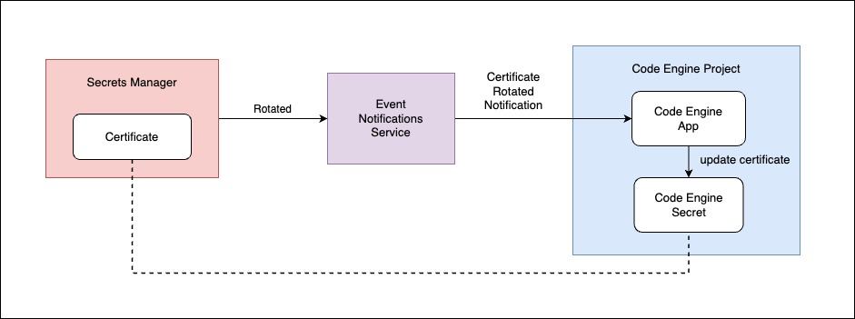

# Certificate Renewal using Code Engine and Event Notifications

## Introduction
The goal here is to build a simple app using IBM Cloud Code Engine to update the secrets in a project. \
The IBM Services which we will be using are:
- [IBM Cloud Code Engine](https://cloud.ibm.com/docs/codeengine?topic=codeengine-getting-started)
- [IBM Cloud Event Notifications](https://cloud.ibm.com/docs/event-notifications?topic=event-notifications-en-about)
- [IBM Cloud Secrets Manager](https://cloud.ibm.com/docs/secrets-manager?topic=secrets-manager-getting-started)

It is not required to have prerequiste knowledge on the services (Although brief knowledge would be good). \
You can just follow the instructions and you will be able to build this sample application

## Let's Get Started

Let's say we have a secret (eg: TLS Certficate with Private key) stored in Secrets Manager. The same secret will be stored in your Code Engine Project which will be utilised by your workloads within the code engine project.
We will build a Code Engine Application to retrieve the secrets from the Secrets Manager and update it in the project. \
We will also implement Event Notifications so that it can send notification to our App whenever the secret gets rotated in the project, the app can then do the updation.

These are the steps which we will follow:
 
1. We will create an instance in the Secrets Manager and Event Notifications
2. We will create a secret in the Secrets Manager
3. We will build a Code Engine App (code is already provided)
4. We will create same secret in the Code Engine Project 
5. We will create necessary sources, topics, destination etc., in Event Notifications
6. We will bind all these components together
7. At last we will manually rotate the secrets in Secrets Manager 
8. We will check the logs of the apps to verify if secret got updated in Code Engine Project

## Instructions to use:
- Install Code Engine cli \
  Command: `ibmcloud plugin install code-engine`
- Install Event Notifications cli, version 1.0.1 or later\
  Command: `ibmcloud plugin install event-notifications`
- Install the Secrets Manager CLI \
  Command: `ibmcloud plugin install secrets-manager`
- Login to your IBM Cloud Account and select the region and resource group \
  Command: `ibmcloud login --sso -g <resource-group> -r <region>`
- Select the Code Engine Project where you would like to use this sample application \
  To select the Code Engine Project do `ibmcloud ce project select -n <project_name>`
  (Note: If you do not have a Code Engine Project already, then you can create a new project. Instructions can be found here [documentation](https://cloud.ibm.com/docs/codeengine?topic=codeengine-manage-project#create-a-project))
- Update your `api-key` value in the `run.sh` file
- Execute the run script using command: `./run.sh`

## What happens under the hood?
Architecture: \

- The run script will create the Event Notifications Instance and Secrets Manager Instance of lite plan
- A secret will be created in the Secret Manager with certificate and key
- Necessary components like topics, sources, destinations and subscriptions will be created in the Event Notification Instance
- The script will create Code Engine application and Code Engine secret which will reside in the project selected.
- At last we will rotate the secret in the Secrets Manager with new certificate
- When the secret is rotated, Secrets Manager will send notification to Event Notification
- Event Notification instance will then invoke the Code Engine Application
- The App will retrieve the secret from Secrets Manager and update the Secret in the project

As we have seen that Event Notification will invoke our application via sending POST request to it with the notification. But there is one caveat here, there is a reponse timeout from Event Notifications which is 60 seconds. To know more about it check the [documentation](https://cloud.ibm.com/docs/event-notifications?topic=event-notifications-en-destinations-codeengine#en-codengine-retry).

So the App should scale up and process the response(i.e retrieve secret from Secrets Manager and update it in the project) within 60 seconds.

If you consider to execute a longer workload then you can use the Code Engine Job for the same.
Refer this [documentation](https://cloud.ibm.com/docs/codeengine?topic=codeengine-job-plan) to know more about Code Engine Jobs